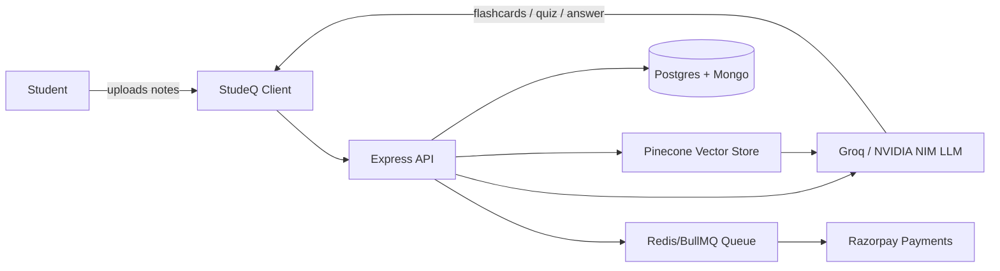

# StudeQ — System Architecture

High level architecture of StudeQ's **AI study platform**: client, API, RAG pipeline, queues, and payments.

## System Diagram

## Components

| Component | Role |
|---|---|
| **StudeQ Client** | React (Vite) SPA. Auth via httpOnly cookies, CSS Modules theming, Socket.io client for study rooms. |
| **Express API** | Central backend. REST endpoints, `asyncHandler` + `ApiError`/`ApiResponse` pattern, Zod validation. |
| **Pinecone Vector Store** | Stores embeddings (`@xenova/transformers`, BGE) of uploaded notes for RAG retrieval. |
| **Groq / NVIDIA NIM** | Multi-LLM orchestration layer — generates flashcards, quizzes, and grounded Q&A answers. |
| **Postgres (Prisma)** | Relational data — users, plans, structured records. |
| **MongoDB (Mongoose)** | Document data — notes, flashcards, quiz content. |
| **Redis / BullMQ** | Job queue — webhook processing, payment capture, async tasks. Deduplication via Redis keys. |
| **Razorpay** | Payment gateway. Webhooks processed idempotently through BullMQ workers, triggers XP/gamification hooks on success. |

## Data Flow — RAG Study Assistant

1. Student uploads notes via client.
2. Express API chunks + embeds content, stores vectors in Pinecone.
3. On a question/quiz request, API retrieves relevant chunks from Pinecone.
4. Retrieved context + query sent to Groq/NVIDIA NIM for generation.
5. Response (flashcard/quiz/answer) returned to client.

## Data Flow — Payments

1. Client initiates checkout (React checkout hook).
2. Razorpay webhook hits Express API.
3. Event pushed to BullMQ queue, deduplicated via Redis.
4. Worker processes payment capture idempotently, updates Postgres, triggers XP/gamification hooks.

## Deployment

- Hosted on **Render** (monorepo: `client/` + `server/`).
- Postgres via Supabase (Session pooler URL for Render compatibility).
- Redis via Upstash.