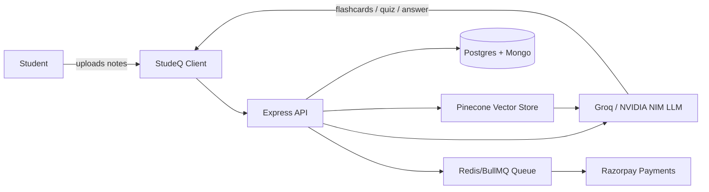

## What

StudeQ is a private, full stack **AI study platform** built for exam prep and personalized learning. At its core is a **RAG (Retrieval Augmented Generation) study assistant**: students upload their own notes/documents, StudeQ embeds them (Pinecone + Xenova BGE embeddings), and a multi LLM pipeline (Groq Llama 3.3 70B, NVIDIA NIM) generates answers, flashcards, and quizzes *grounded in that material* — not generic, hallucinated content pulled from the model's training data.

Beyond RAG, StudeQ bundles the full exam prep toolchain a student would otherwise juggle across separate apps:
- **AI flashcards generator** — spaced repetition cards auto built from uploaded notes
- **AI quiz generator** — instant practice quizzes scoped to a topic, chapter, or document
- **Smart study scheduler / timetable** — plan and track prep across subjects
- **Real time study rooms** — Socket.io powered collaborative sessions with peers
- **Gamification (XP/streaks)** — tied into study activity and payment-unlocked features
- **Premium plans via Razorpay** — idempotent payment processing through BullMQ + Redis dedup

Architecturally, it's a dual database system (PostgreSQL via Prisma for relational/transactional data, MongoDB via Mongoose for flexible content/study data), backed by Redis/BullMQ for async job processing and queue-based payment webhooks.

## Why

The Indian exam prep landscape is fragmented: one app for flashcards, another for quizzes, a separate notebook or spreadsheet for scheduling — none of them actually understand the student's own syllabus material. Most "AI" study tools generate generic content disconnected from what the student actually uploaded, which means answers can be wrong, off syllabus, or just not useful for the specific exam being prepped for.

StudeQ exists to fix that by making the AI **source grounded by default** — every flashcard, quiz question, and assistant answer traces back to material the student themselves provided, via the RAG pipeline. The goal is one tool covering the full prep loop (notes → understanding → practice → scheduling → tracking) instead of five disconnected ones.

It's also built and operated as a real production system, not a prototype: cookie based auth (not localStorage tokens), idempotent payment webhook handling, Redis backed rate limiting and caching, and a hardened deployment on Render — built solo, end to end, with production reliability as a first class concern rather than an afterthought.

## Who it's for

| User | Use case |
|---|---|
| Exam aspirants (board exams, competitive exams) | Convert their own notes into flashcards and quizzes fast, without manual card-writing |
| Self-learners | Ask questions and get answers grounded in their own uploaded study material via the RAG assistant |
| Study groups / peer learners | Use real-time Socket.io study rooms to prep together |
| Anyone evaluating access | StudeQ is a **private repository** — it is not open source. Access for contribution is granted on a discussion basis: reach out on [Discord](https://demo.com) first, align on contribution guidelines, then get added once approved |

## How it fits together
 

## Status
 
Live: [studeq.onrender.com](https://studeq.onrender.com). 
Private repo — see [Contributing](README.md#contributing) to request access via Discord.