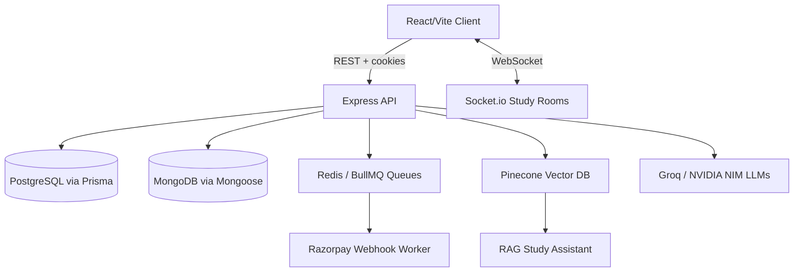

# StudeQ — AI Study Platform for Exam Prep & Smart Learning

> Open source AI powered learning app for India — RAG study assistant, AI flashcards generator, smart scheduler & exam prep tool, built on a modern full stack MERN+ architecture.

**Live demo:** [studeq.onrender.com](https://studeq.onrender.com)

[StudeQ dashboard screenshot — AI study platform showing flashcards, quiz, and scheduler tools](https://studeq.onrender.com)

*Screenshot placeholder: StudeQ dashboard — AI powered study tools for exam prep*

---

## What is StudeQ?

StudeQ is an **AI powered learning app for Indian students** — a RAG driven study assistant that turns notes into AI flashcards, auto generated quizzes, and a smart study scheduler. Built for solo learners and exam aspirants who want an AI exam prep tool that actually understands their material, not generic flashcard decks.

## Features

- **RAG Study Assistant** — Pinecone + BGE embeddings ground answers in *your* uploaded notes, not hallucinated generic content
- **AI Flashcards Generator** — auto generate spaced repetition flashcards from notes via multi LLM orchestration (Groq, NVIDIA NIM)
- **AI Quiz Generator** — instant practice quizzes scoped to a topic or document
- **Smart Study Scheduler / Timetable** — plan and track exam prep across subjects
- **Real time Study Rooms** — Socket.io powered collaborative sessions
- **Gamification / XP System** — streaks and XP hooks tied into payments and study activity
- **Razorpay Payment Integration** — idempotent webhook processing via BullMQ + Redis dedup
- **Dark/Light Theming** — responsive, mobile first UI with CSS Modules
- **httpOnly Cookie Auth** — secure session auth, no localStorage token leakage

## Tech Stack

| Layer | Technology |
|---|---|
| Frontend | React (Vite), CSS Modules |
| Backend | Node.js, Express |
| Relational DB | PostgreSQL + Prisma ORM |
| Document DB | MongoDB + Mongoose |
| Cache / Queue | Redis + BullMQ |
| Real-time | Socket.io |
| Vector Search | Pinecone + Xenova/transformers (BGE embeddings) |
| LLM Orchestration | Groq (Llama 3.3 70B), NVIDIA NIM |
| Payments | Razorpay |
| Hosting | Render |

## Architecture

## API Documentation

See [`docs/API.md`](docs/API.md) for full endpoint reference.

## Roadmap

- [ ] Public API docs site
- [ ] Mobile app (React Native)
- [ ] Offline flashcard mode
- [ ] Multi-language support (Hindi, regional languages)

## Contributing

This is a **private repository**. To contribute, join our [Discord](https://demo.com) first to discuss access and align with the contribution guidelines — once approved, you're welcome to contribute. See [`CONTRIBUTING.md`](CONTRIBUTING.md) for setup and codestyle once access is granted.

## License

MIT — see [`LICENSE`](LICENSE).
